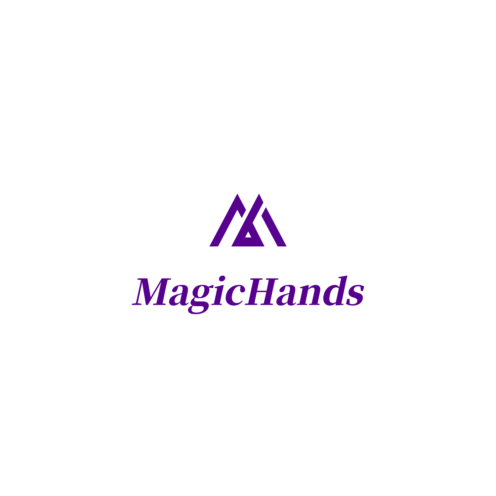

###### ps:本库目前基于AGPL-3.0协议,请注意如果您使用此库的任何代码,都要保证您的源码完全开源,否则后果您懂得.
 

# 莫愁前路无知己,天下谁人不识君.

### 声明：本库允许学习使用,允许使用者利用此库制作收费脚本,但不允许在此库基础上套壳变成收费框架!

# Android自动化引擎 · MagicHands

> The only people who have anything to fear from free software are those whose products are worth even less. 
>
> <p align="right">——David Emery</p>

MagicHands，是一款自动化测试引擎，可以在Android7.0以上免root运行自动化脚本，使用js编写，可以编写nodejs,python,java插件来扩展功能。


## 作者的碎碎念

喜欢开源,这让我很舒服,就和一个上帝一样,创造出自己喜欢的东西.


## 找我
在线时间:(北京)12:00-00:00
- Q群:710985269
- QQ:3560000009
- Wx:php787 

## 支持

目前已兼容 7.0 ～ 12.0并跟进后续新系统

## 如何使用

[点我看视频教程](https://www.bilibili.com/video/BV14h4y1y7YK/?spm_id_from=333.999.0.0)

### Step 1.初始化：

参考示例中的MainActivity的初始化工作流程

### Step 2.编写Js代码并运行：

在assets文件下新建js文件夹,在js文件夹下新建main.js为入口,在入口调用接口即可


### 相关API

```JavaScript
/**
获取给定节点的文本内容
@权限 无障碍
@函数名 getText
@参数 node - 节点对象
@返回值 成功:文本内容 失败:null
@功能 获取给定节点的文本内容
*/
function getText(node) {
    return js.getText(node);
 }

 
/**
尝试点击节点
@权限 无障碍
@函数名 tryClick
@参数 node - 节点对象
@返回值 成功:true 失败:false
@功能 尝试点击目标节点,当传入节点无法节点会依次向上层节点进行点击尝试
*/
function tryClick(node){
    return js.tryClick(node)
}


/**
获取节点的父亲节点
@权限 无障碍
@函数名 getParentNode
@参数 node - 节点
@返回值 成功:节点信息 失败:null
@功能 获取当前节点的父亲节点
*/
function getParentNode(node){
    return js.getParentNode(node)
}


/**
获取坐标点的Rgb值
@权限 常规权限
@函数名 getRgb
@参数 b - Bit对象 @参数 x - x坐标 @参数 y - y坐标
@返回值 成功:rgb字符串 失败:null
@功能 获取指定坐标点的rgb字符串
*/
function getRgb(b,x,y){
    return js.getRgb(b,x,y)
}

/**
捕获屏幕
@权限 常规权限
@函数名 setUpVirtualDisplay
@功能 捕获当前界面
*/
function setUpVirtualDisplay(){
     js.setUpVirtualDisplay()
}

/**
获取捕获的bit对象
@权限 常规权限
@函数名 getBitmap
@返回值 成功:bit对象 失败:null
@功能 获取捕获的bit对象
*/
function getBitmap(){
    return js.getBitmap()
}

```

更多其他操作看在线文档:[api.js](https://pingaa.gitee.io/magichands)【在线文档暂不太完善】


## 计划

 - 寄生模式(虚拟化)

## 感谢

- [rhino](https://github.com/mozilla/rhino)
- [Android-Accessibility-Api](https://github.com/Vove7/Android-Accessibility-Api)

### License

> ```
> AGPL-3.0 license
> ```

>Copyright (c) 2023 pingan
